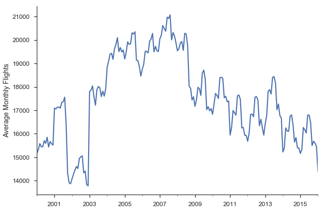
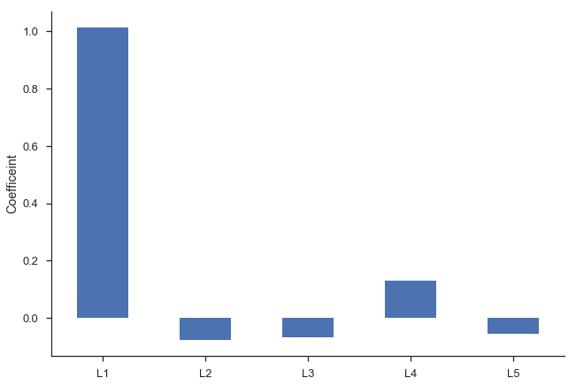
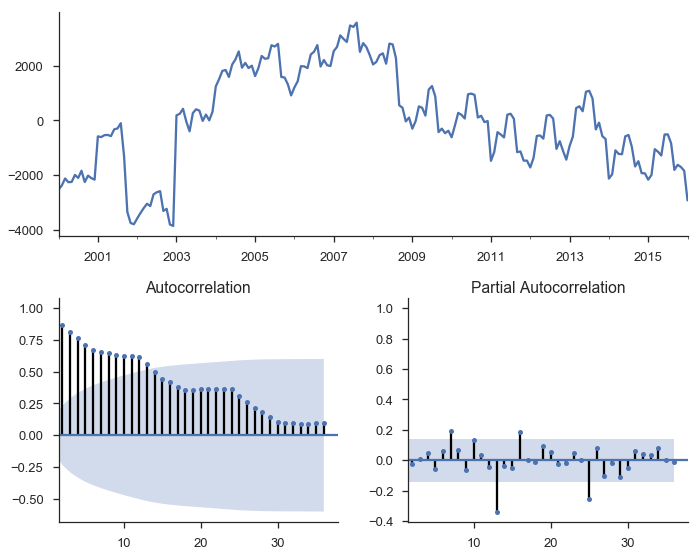
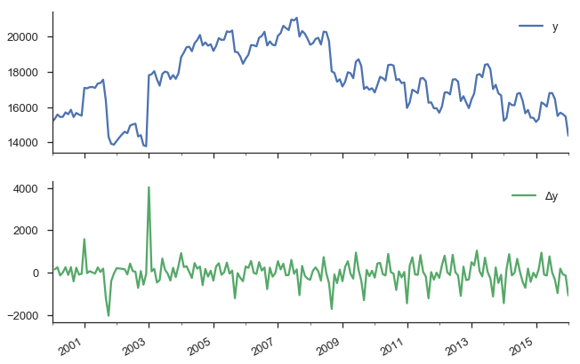
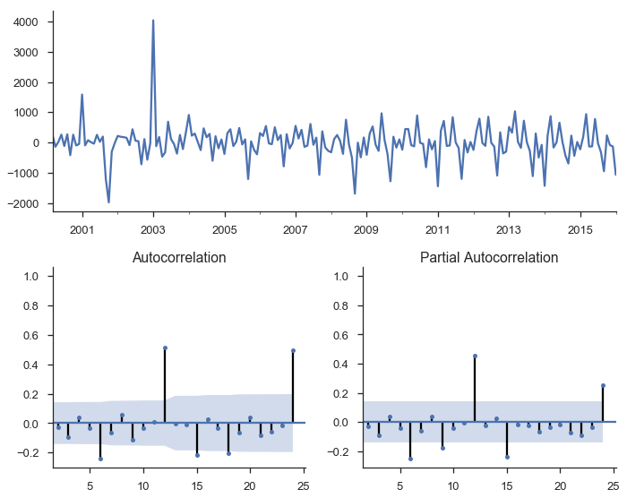
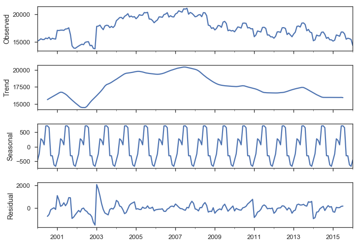
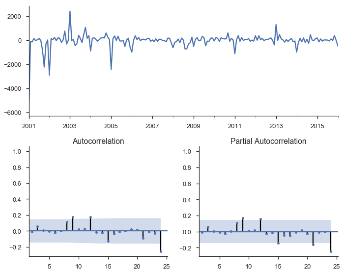

[TOC]

---

# Modeling Time Series

We'll focus on modelling Average Monthly Flights. 


```python
ax = y.plot()
ax.set(ylabel='Average Monthly Flights')
sns.despine()
```





```python
import statsmodels.formula.api as smf
import statsmodels.tsa.api as smt
import statsmodels.api as sm
```

Think back to a typical regression problem, the usual task is to predict some value $y$ using some a linear combination of features in $X$.

$$y = \beta_0 + \beta_1 X_1 + \ldots + \beta_p X_p + \epsilon$$

> When working with time series, some of the most important (and sometimes the *only*) features are the previous, or *lagged*, values of $y$.

### "Manually" regressing `y` on lagged values of itself
- First, let's create a dataframe with our lagged values of `y` using the `.shift` method, 
  which shifts the index `i` periods, so it lines up with that observation.

<table border="1" class="dataframe">
  <thead>
    <tr style="text-align: right;">
      <th></th>
      <th>y</th>
      <th>L1</th>
      <th>L2</th>
      <th>L3</th>
      <th>L4</th>
      <th>L5</th>
    </tr>
  </thead>
  <tbody>
    <tr>
      <th>2000-06-01</th>
      <td>15703.333333</td>
      <td>15448.677419</td>
      <td>15442.100000</td>
      <td>15578.838710</td>
      <td>15327.551724</td>
      <td>15176.677419</td>
    </tr>
    <tr>
      <th>2000-07-01</th>
      <td>15591.677419</td>
      <td>15703.333333</td>
      <td>15448.677419</td>
      <td>15442.100000</td>
      <td>15578.838710</td>
      <td>15327.551724</td>
    </tr>
    <tr>
      <th>2000-08-01</th>
      <td>15850.516129</td>
      <td>15591.677419</td>
      <td>15703.333333</td>
      <td>15448.677419</td>
      <td>15442.100000</td>
      <td>15578.838710</td>
    </tr>
    <tr>
      <th>2000-09-01</th>
      <td>15436.566667</td>
      <td>15850.516129</td>
      <td>15591.677419</td>
      <td>15703.333333</td>
      <td>15448.677419</td>
      <td>15442.100000</td>
    </tr>
    <tr>
      <th>2000-10-01</th>
      <td>15669.709677</td>
      <td>15436.566667</td>
      <td>15850.516129</td>
      <td>15591.677419</td>
      <td>15703.333333</td>
      <td>15448.677419</td>
    </tr>
  </tbody>
</table>
- We can fit the lagged model using statsmodels (which uses [patsy](http://patsy.readthedocs.org) to translate the formula string to a design matrix).


```python
mod_lagged = smf.ols('y ~ trend + L1 + L2 + L3 + L4 + L5',
                     data=X.assign(trend=np.arange(len(X))))
res_lagged = mod_lagged.fit()
res_lagged.summary()
```


<table class="simpletable">
<caption>OLS Regression Results</caption>
<tr>
  <th>Dep. Variable:</th>            <td>y</td>        <th>  R-squared:         </th> <td>   0.896</td>
</tr>
<tr>
  <th>Model:</th>                   <td>OLS</td>       <th>  Adj. R-squared:    </th> <td>   0.893</td>
</tr>
<tr>
  <th>Method:</th>             <td>Least Squares</td>  <th>  F-statistic:       </th> <td>   261.1</td>
</tr>
<tr>
  <th>Date:</th>             <td>Sun, 03 Sep 2017</td> <th>  Prob (F-statistic):</th> <td>2.61e-86</td>
</tr>
<tr>
  <th>Time:</th>                 <td>11:09:03</td>     <th>  Log-Likelihood:    </th> <td> -1461.2</td>
</tr>
<tr>
  <th>No. Observations:</th>      <td>   188</td>      <th>  AIC:               </th> <td>   2936.</td>
</tr>
<tr>
  <th>Df Residuals:</th>          <td>   181</td>      <th>  BIC:               </th> <td>   2959.</td>
</tr>
<tr>
  <th>Df Model:</th>              <td>     6</td>      <th>                     </th>     <td> </td>   
</tr>
<tr>
  <th>Covariance Type:</th>      <td>nonrobust</td>    <th>                     </th>     <td> </td>   
</tr>
</table>
<table class="simpletable">
<tr>
      <td></td>         <th>coef</th>     <th>std err</th>      <th>t</th>      <th>P>|t|</th>  <th>[0.025</th>    <th>0.975]</th>  
</tr>
<tr>
  <th>Intercept</th> <td> 1055.4443</td> <td>  459.096</td> <td>    2.299</td> <td> 0.023</td> <td>  149.575</td> <td> 1961.314</td>
</tr>
<tr>
  <th>trend</th>     <td>   -1.0395</td> <td>    0.795</td> <td>   -1.307</td> <td> 0.193</td> <td>   -2.609</td> <td>    0.530</td>
</tr>
<tr>
  <th>L1</th>        <td>    1.0143</td> <td>    0.075</td> <td>   13.543</td> <td> 0.000</td> <td>    0.867</td> <td>    1.162</td>
</tr>
<tr>
  <th>L2</th>        <td>   -0.0769</td> <td>    0.106</td> <td>   -0.725</td> <td> 0.470</td> <td>   -0.286</td> <td>    0.133</td>
</tr>
<tr>
  <th>L3</th>        <td>   -0.0666</td> <td>    0.106</td> <td>   -0.627</td> <td> 0.531</td> <td>   -0.276</td> <td>    0.143</td>
</tr>
<tr>
  <th>L4</th>        <td>    0.1311</td> <td>    0.106</td> <td>    1.235</td> <td> 0.219</td> <td>   -0.078</td> <td>    0.341</td>
</tr>
<tr>
  <th>L5</th>        <td>   -0.0567</td> <td>    0.075</td> <td>   -0.758</td> <td> 0.449</td> <td>   -0.204</td> <td>    0.091</td>
</tr>
</table>
<table class="simpletable">
<tr>
  <th>Omnibus:</th>       <td>74.709</td> <th>  Durbin-Watson:     </th> <td>   1.979</td> 
</tr>
<tr>
  <th>Prob(Omnibus):</th> <td> 0.000</td> <th>  Jarque-Bera (JB):  </th> <td> 851.300</td> 
</tr>
<tr>
  <th>Skew:</th>          <td> 1.114</td> <th>  Prob(JB):          </th> <td>1.39e-185</td>
</tr>
<tr>
  <th>Kurtosis:</th>      <td>13.184</td> <th>  Cond. No.          </th> <td>4.24e+05</td> 
</tr>
</table>


### Problems with this approach 
- Our lagged values are highly correlated with each other, our regression suffers from [multicollinearity](https://en.wikipedia.org/wiki/Multicollinearity), and that ruins our estimates of the slopes.


```python
sns.heatmap(X.corr());
```


- Second, we'd intuitively expect the $\beta_i$s to gradually decline to zero.
  - The immediately preceding period *should* be most important ($\beta_1$ is the largest coefficient in absolute value), followed by $\beta_2$, and $\beta_3$...
  - Looking at the regression summary and the bar graph below, this isn't the case 


```python
ax = res_lagged.params.drop(['Intercept', 'trend']).plot.bar(rot=0)
plt.ylabel('Coefficeint')
sns.despine()
```




### Autocorrelation

- Another problem our lagged model suffered from is [autocorrelation](https://en.wikipedia.org/wiki/Autocorrelation) (also know as serial correlation).
- There's a clear pattern in the residuals of our regression model
- Let's fit a simple model of $y = \beta_0 + \beta_1 T + \epsilon$, 
  where `T` is the time trend (`np.arange(len(y))`).


```python
# `Results.resid` is a Series of residuals: y - ŷ
mod_trend = sm.OLS.from_formula(
    'y ~ trend', data=y.to_frame(name='y')
                       .assign(trend=np.arange(len(y))))
res_trend = mod_trend.fit()
```

- Residuals (the observed minus the expected, or $\hat{e_t} = y_t - \hat{y_t}$) are supposed to be [white noise](https://en.wikipedia.org/wiki/White_noise). That's [one of the assumptions](https://en.wikipedia.org/wiki/Gauss–Markov_theorem) many of the properties of linear regression are founded upon.
- **In this case there's a correlation between one residual and the next**: 
  if the residual at time $t$ was above expectation, then the residual at time $t + 1$ is *much* more likely to be above average as well ($e_t > 0 \implies E_t[e_{t+1}] > 0$).

We'll define a helper function to plot the residuals time series, and some diagnostics about them.


```python
def tsplot(y, lags=None, figsize=(10, 8)):
    fig = plt.figure(figsize=figsize)
    layout = (2, 2)
    ts_ax = plt.subplot2grid(layout, (0, 0), colspan=2)
    acf_ax = plt.subplot2grid(layout, (1, 0))
    pacf_ax = plt.subplot2grid(layout, (1, 1))
    
    y.plot(ax=ts_ax)
    smt.graphics.plot_acf(y, lags=lags, ax=acf_ax)
    smt.graphics.plot_pacf(y, lags=lags, ax=pacf_ax)
    [ax.set_xlim(1.5) for ax in [acf_ax, pacf_ax]]
    sns.despine()
    plt.tight_layout()
    return ts_ax, acf_ax, pacf_ax
```

Calling it on the residuals from the linear trend:


```python
tsplot(res_trend.resid, lags=36);
```




- The top subplot shows the **time series of our residuals** $e_t$, which should be white noise (but it isn't).
- The bottom shows the [autocorrelation](https://www.otexts.org/fpp/2/2#autocorrelation) of the residuals as a correlogram.
- The partial autocorrelation plot in the bottom-right shows a similar concept.
  It's partial in the sense that the value for $corr(e_t, e_{t-k})$ is the correlation between those two periods, after controlling for the values at all shorter lags.

### Stationarity

- Autocorrelation is a problem in regular regressions like above, but we'll use it to our advantage when we setup an ARIMA model
- The basic idea is pretty sensible: 
  If your regression residuals have a clear pattern, then there's clearly some structure in the data that you aren't taking advantage of. If a positive residual today means you'll likely have a positive residual tomorrow, why not incorporate that information into your forecast, and lower your forecasted value for tomorrow? That's pretty much what ARIMA does.
- It's important that your dataset be **stationary**, otherwise you run the risk of finding [spurious correlations](http://www.tylervigen.com/spurious-correlations).
- The typical way to handle non-stationarity is to difference the non-stationary variable until is is stationary.


```python
y.to_frame(name='y').assign(Δy=lambda x: x.y.diff()).plot(subplots=True)
sns.despine()
```




- We have more rigorous methods for detecting whether a series is non-stationary
  - One popular method is the Augmented Dickey-Fuller test.
    It's a statistical hypothesis test that roughly says:
    - $H_0$ (null hypothesis): $y$ is non-stationary, needs to be differenced
    - $H_A$ (alternative hypothesis): $y$ is stationary, doesn't need to be differenced
  - This is implemented in statsmodels as [`smt.adfuller`](http://www.statsmodels.org/dev/generated/statsmodels.tsa.stattools.adfuller.html).


```python
from collections import namedtuple

ADF = namedtuple("ADF", "adf pvalue usedlag nobs critical icbest")
```


```python
ADF(*smt.adfuller(y))._asdict()
```


    OrderedDict([('adf', -1.3206520699512339),
                 ('pvalue', 0.61967180643147923),
                 ('usedlag', 15),
                 ('nobs', 177),
                 ('critical',
                  {'1%': -3.4678453197999071,
                   '10%': -2.575551186759871,
                   '5%': -2.8780117454974392}),
                 ('icbest', 2710.6120408261486)])


So we failed to reject the null hypothesis that the original series was non-stationary.
Let's difference it.


```python
ADF(*smt.adfuller(y.diff().dropna()))._asdict()
```


    OrderedDict([('adf', -3.6412428797327996),
                 ('pvalue', 0.0050197770854934548),
                 ('usedlag', 14),
                 ('nobs', 177),
                 ('critical',
                  {'1%': -3.4678453197999071,
                   '10%': -2.575551186759871,
                   '5%': -2.8780117454974392}),
                 ('icbest', 2696.3891181091631)])


This looks better.
It's not statistically significant at the 5% level, but who cares what statisticians say anyway.

We'll fit another OLS model of $\Delta y = \beta_0 + \beta_1 L \Delta y_{t-1} + e_t$


```python
data = (y.to_frame(name='y')
         .assign(Δy=lambda df: df.y.diff())
         .assign(LΔy=lambda df: df.Δy.shift()))
mod_stationary = smf.ols('Δy ~ LΔy', data=data.dropna())
res_stationary = mod_stationary.fit()
```


```python
tsplot(res_stationary.resid, lags=24);
```





So we've taken care of multicolinearity, autocorelation, and stationarity, but we still aren't done.

## Seasonality

We have strong monthly seasonality:


```python
smt.seasonal_decompose(y).plot();
```





There are a few ways to handle seasonality.
We'll just rely on the `SARIMAX` method to do it for us.
For now, recognize that it's a problem to be solved.

## ARIMA

So, we've sketched the problems with regular old regression: multicollinearity, autocorrelation, non-stationarity, and seasonality.
Our tool of choice, `smt.SARIMAX`, which stands for Seasonal ARIMA with eXogenous regressors, can handle all these.
We'll walk through the components in pieces.

ARIMA stands for AutoRegressive Integrated Moving Average.
It's a relatively simple yet flexible way of modeling univariate time series.
It's made up of three components, and is typically written as $\mathrm{ARIMA}(p, d, q)$.

ARIMA stands for AutoRegressive Integrated Moving Average, and it's a relatively simple way of modeling univariate time series.
It's made up of three components, and is typically written as $\mathrm{ARIMA}(p, d, q)$.

### [AutoRegressive](https://www.otexts.org/fpp/8/3)

The idea is to predict a variable by a linear combination of its lagged values (*auto*-regressive as in regressing a value on its past *self*).
An AR(p), where $p$ represents the number of lagged values used, is written as

$$y_t = c + \phi_1 y_{t-1} + \phi_2 y_{t-2} + \ldots + \phi_p y_{t-p} + e_t$$

$c$ is a constant and $e_t$ is white noise.
This looks a lot like a linear regression model with multiple predictors, but the predictors happen to be lagged values of $y$ (though they are estimated differently).

### Integrated

Integrated is like the opposite of differencing, and is the part that deals with stationarity.
If you have to difference your dataset 1 time to get it stationary, then $d=1$.
We'll introduce one bit of notation for differencing: $\Delta y_t = y_t - y_{t-1}$ for $d=1$.

### [Moving Average](https://www.otexts.org/fpp/8/4)

MA models look somewhat similar to the AR component, but it's dealing with different values.

$$y_t = c + e_t + \theta_1 e_{t-1} + \theta_2 e_{t-2} + \ldots + \theta_q e_{t-q}$$

$c$ again is a constant and $e_t$ again is white noise.
But now the coefficients are the *residuals* from previous predictions.

### Combining

Putting that together, an ARIMA(1, 1, 1) process is written as

$$\Delta y_t = c + \phi_1 \Delta y_{t-1} + \theta_t e_{t-1} + e_t$$

Using *lag notation*, where $L y_t = y_{t-1}$, i.e. `y.shift()` in pandas, we can rewrite that as

$$(1 - \phi_1 L) (1 - L)y_t = c + (1 + \theta L)e_t$$

That was for our specific $\mathrm{ARIMA}(1, 1, 1)$ model. For the general $\mathrm{ARIMA}(p, d, q)$, that becomes

$$(1 - \phi_1 L - \ldots - \phi_p L^p) (1 - L)^d y_t = c + (1 + \theta L + \ldots + \theta_q L^q)e_t$$

We went through that *extremely* quickly, so don't feel bad if things aren't clear.
Fortunately, the model is pretty easy to use with statsmodels (using it *correctly*, in a statistical sense, is another matter).


```python
mod = smt.SARIMAX(y, trend='c', order=(1, 1, 1))
res = mod.fit()
tsplot(res.resid[2:], lags=24);
```


```python
res.summary()
```


<table class="simpletable">
<caption>Statespace Model Results</caption>
<tr>
  <th>Dep. Variable:</th>        <td>fl_date</td>     <th>  No. Observations:  </th>    <td>193</td>   
</tr>
<tr>
  <th>Model:</th>           <td>SARIMAX(1, 1, 1)</td> <th>  Log Likelihood     </th> <td>-1494.618</td>
</tr>
<tr>
  <th>Date:</th>            <td>Sun, 03 Sep 2017</td> <th>  AIC                </th> <td>2997.236</td> 
</tr>
<tr>
  <th>Time:</th>                <td>11:12:22</td>     <th>  BIC                </th> <td>3010.287</td> 
</tr>
<tr>
  <th>Sample:</th>             <td>01-01-2000</td>    <th>  HQIC               </th> <td>3002.521</td> 
</tr>
<tr>
  <th></th>                   <td>- 01-01-2016</td>   <th>                     </th>     <td> </td>    
</tr>
<tr>
  <th>Covariance Type:</th>        <td>opg</td>       <th>                     </th>     <td> </td>    
</tr>
</table>
<table class="simpletable">
<tr>
      <td></td>         <th>coef</th>     <th>std err</th>      <th>z</th>      <th>P>|z|</th>  <th>[0.025</th>    <th>0.975]</th>  
</tr>
<tr>
  <th>intercept</th> <td>   -5.4306</td> <td>   66.818</td> <td>   -0.081</td> <td> 0.935</td> <td> -136.391</td> <td>  125.529</td>
</tr>
<tr>
  <th>ar.L1</th>     <td>   -0.0327</td> <td>    2.689</td> <td>   -0.012</td> <td> 0.990</td> <td>   -5.303</td> <td>    5.237</td>
</tr>
<tr>
  <th>ma.L1</th>     <td>    0.0775</td> <td>    2.667</td> <td>    0.029</td> <td> 0.977</td> <td>   -5.149</td> <td>    5.305</td>
</tr>
<tr>
  <th>sigma2</th>    <td> 3.444e+05</td> <td> 1.69e+04</td> <td>   20.392</td> <td> 0.000</td> <td> 3.11e+05</td> <td> 3.77e+05</td>
</tr>
</table>
<table class="simpletable">
<tr>
  <th>Ljung-Box (Q):</th>          <td>225.58</td> <th>  Jarque-Bera (JB):  </th> <td>1211.00</td>
</tr>
<tr>
  <th>Prob(Q):</th>                 <td>0.00</td>  <th>  Prob(JB):          </th>  <td>0.00</td>  
</tr>
<tr>
  <th>Heteroskedasticity (H):</th>  <td>0.67</td>  <th>  Skew:              </th>  <td>1.20</td>  
</tr>
<tr>
  <th>Prob(H) (two-sided):</th>     <td>0.12</td>  <th>  Kurtosis:          </th>  <td>15.07</td> 
</tr>
</table>


There's a bunch of output there with various tests, estimated parameters, and information criteria.
Let's just say that things are looking better, but we still haven't accounted for seasonality.

A seasonal ARIMA model is written as $\mathrm{ARIMA}(p,d,q)×(P,D,Q)_s$.
Lowercase letters are for the non-seasonal component, just like before. Upper-case letters are a similar specification for the seasonal component, where $s$ is the periodicity (4 for quarterly, 12 for monthly).

It's like we have two processes, one for non-seasonal component and one for seasonal components, and we multiply them together with regular algebra rules.

The general form of that looks like (quoting the [statsmodels docs](http://www.statsmodels.org/dev/examples/notebooks/generated/statespace_sarimax_stata.html) here)

$$\phi_p(L)\tilde{\phi}_P(L^S)\Delta^d\Delta_s^D y_t = A(t) + \theta_q(L)\tilde{\theta}_Q(L^s)e_t$$

where

- $\phi_p(L)$ is the non-seasonal autoregressive lag polynomial
- $\tilde{\phi}_P(L^S)$ is the seasonal autoregressive lag polynomial
- $\Delta^d\Delta_s^D$ is the time series, differenced  $d$ times, and seasonally differenced $D$ times.
- $A(t)$ is the trend polynomial (including the intercept)
- $\theta_q(L)$ is the non-seasonal moving average lag polynomial
- $\tilde{\theta}_Q(L^s)$  is the seasonal moving average lag polynomial

I don't find that to be very clear, but maybe an example will help.
We'll fit a seasonal ARIMA$(1,1,2)×(0, 1, 2)_{12}$.

So the nonseasonal component is

- $p=1$: period autoregressive: use $y_{t-1}$
- $d=1$: one first-differencing of the data (one month)
- $q=2$: use the previous two non-seasonal residual, $e_{t-1}$ and $e_{t-2}$, to forecast

And the seasonal component is

- $P=0$: Don't use any previous seasonal values
- $D=1$: Difference the series 12 periods back: `y.diff(12)`
- $Q=2$: Use the two previous seasonal residuals


```python
mod_seasonal = smt.SARIMAX(y, trend='c',
                           order=(1, 1, 2), seasonal_order=(0, 1, 2, 12),
                           simple_differencing=False)
res_seasonal = mod_seasonal.fit()
```


```python
res_seasonal.summary()
```


<table class="simpletable">
<caption>Statespace Model Results</caption>
<tr>
  <th>Dep. Variable:</th>               <td>fl_date</td>            <th>  No. Observations:  </th>    <td>193</td>   
</tr>
<tr>
  <th>Model:</th>           <td>SARIMAX(1, 1, 2)x(0, 1, 2, 12)</td> <th>  Log Likelihood     </th> <td>-1357.847</td>
</tr>
<tr>
  <th>Date:</th>                   <td>Sun, 03 Sep 2017</td>        <th>  AIC                </th> <td>2729.694</td> 
</tr>
<tr>
  <th>Time:</th>                       <td>11:12:25</td>            <th>  BIC                </th> <td>2752.533</td> 
</tr>
<tr>
  <th>Sample:</th>                    <td>01-01-2000</td>           <th>  HQIC               </th> <td>2738.943</td> 
</tr>
<tr>
  <th></th>                          <td>- 01-01-2016</td>          <th>                     </th>     <td> </td>    
</tr>
<tr>
  <th>Covariance Type:</th>               <td>opg</td>              <th>                     </th>     <td> </td>    
</tr>
</table>
<table class="simpletable">
<tr>
      <td></td>         <th>coef</th>     <th>std err</th>      <th>z</th>      <th>P>|z|</th>  <th>[0.025</th>    <th>0.975]</th>  
</tr>
<tr>
  <th>intercept</th> <td>  -17.5871</td> <td>   44.920</td> <td>   -0.392</td> <td> 0.695</td> <td> -105.628</td> <td>   70.454</td>
</tr>
<tr>
  <th>ar.L1</th>     <td>   -0.9988</td> <td>    0.013</td> <td>  -74.479</td> <td> 0.000</td> <td>   -1.025</td> <td>   -0.973</td>
</tr>
<tr>
  <th>ma.L1</th>     <td>    0.9956</td> <td>    0.109</td> <td>    9.130</td> <td> 0.000</td> <td>    0.782</td> <td>    1.209</td>
</tr>
<tr>
  <th>ma.L2</th>     <td>    0.0042</td> <td>    0.110</td> <td>    0.038</td> <td> 0.969</td> <td>   -0.211</td> <td>    0.219</td>
</tr>
<tr>
  <th>ma.S.L12</th>  <td>   -0.7836</td> <td>    0.059</td> <td>  -13.286</td> <td> 0.000</td> <td>   -0.899</td> <td>   -0.668</td>
</tr>
<tr>
  <th>ma.S.L24</th>  <td>    0.2118</td> <td>    0.041</td> <td>    5.154</td> <td> 0.000</td> <td>    0.131</td> <td>    0.292</td>
</tr>
<tr>
  <th>sigma2</th>    <td> 1.842e+05</td> <td> 1.21e+04</td> <td>   15.240</td> <td> 0.000</td> <td> 1.61e+05</td> <td> 2.08e+05</td>
</tr>
</table>
<table class="simpletable">
<tr>
  <th>Ljung-Box (Q):</th>          <td>32.57</td> <th>  Jarque-Bera (JB):  </th> <td>1298.39</td>
</tr>
<tr>
  <th>Prob(Q):</th>                <td>0.79</td>  <th>  Prob(JB):          </th>  <td>0.00</td>  
</tr>
<tr>
  <th>Heteroskedasticity (H):</th> <td>0.17</td>  <th>  Skew:              </th>  <td>-1.33</td> 
</tr>
<tr>
  <th>Prob(H) (two-sided):</th>    <td>0.00</td>  <th>  Kurtosis:          </th>  <td>15.89</td> 
</tr>
</table>


```python
tsplot(res_seasonal.resid[12:], lags=24);
```





Things look much better now.

One thing I didn't really talk about is order selection. How to choose $p, d, q, P, D$ and $Q$.
R's forecast package does have a handy `auto.arima` function that does this for you.
Python / statsmodels don't have that at the minute.
The alternative seems to be experience (boo), intuition (boo), and good-old grid-search.
You can fit a bunch of models for a bunch of combinations of the parameters and use the [AIC](https://en.wikipedia.org/wiki/Akaike_information_criterion) or [BIC](https://en.wikipedia.org/wiki/Bayesian_information_criterion) to choose the best.
[Here](https://www.otexts.org/fpp/8/7) is a useful reference, and [this](http://stackoverflow.com/a/22770973) StackOverflow answer recommends a few options.


## Forecasting

Now that we fit that model, let's put it to use.
First, we'll make a bunch of one-step ahead forecasts.
At each point (month), we take the history up to that point and make a forecast for the next month.
So the forecast for January 2014 has available all the data up through December 2013.


```python
pred = res_seasonal.get_prediction(start='2001-03-01')
pred_ci = pred.conf_int()
```


```python
ax = y.plot(label='observed')
pred.predicted_mean.plot(ax=ax, label='Forecast', alpha=.7)
ax.fill_between(pred_ci.index,
                pred_ci.iloc[:, 0],
                pred_ci.iloc[:, 1], color='k', alpha=.2)
ax.set_ylabel("Monthly Flights")
plt.legend()
sns.despine()
```


There are a few places where the observed series slips outside the 95% confidence interval.
The series seems especially unstable before 2005.

Alternatively, we can make *dynamic* forecasts as of some month (January 2013 in the example below).
That means the forecast from that point forward only use information available as of January 2013.
The predictions are generated in a similar way: a bunch of one-step forecasts.
Only instead of plugging in the *actual* values beyond January 2013, we plug in the *forecast* values.


```python
pred_dy = res_seasonal.get_prediction(start='2002-03-01', dynamic='2013-01-01')
pred_dy_ci = pred_dy.conf_int()
```


```python
ax = y.plot(label='observed')
pred_dy.predicted_mean.plot(ax=ax, label='Forecast')
ax.fill_between(pred_dy_ci.index,
                pred_dy_ci.iloc[:, 0],
                pred_dy_ci.iloc[:, 1], color='k', alpha=.25)
ax.set_ylabel("Monthly Flights")

# Highlight the forecast area
ax.fill_betweenx(ax.get_ylim(), pd.Timestamp('2013-01-01'), y.index[-1],
                 alpha=.1, zorder=-1)
ax.annotate('Dynamic $\\longrightarrow$', (pd.Timestamp('2013-02-01'), 550))

plt.legend()
sns.despine()
```


## Resources

This is a collection of links for those interested.

### Time series modeling in Python

+ [Statsmodels Statespace Notebooks](http://www.statsmodels.org/dev/examples/index.html#statespace)
+ [Statsmodels VAR tutorial](http://www.statsmodels.org/dev/vector_ar.html#var)
- [ARCH Library by Kevin Sheppard](https://github.com/bashtage/arch)

### General Textbooks

- [Forecasting: Principles and Practice](https://www.otexts.org/fpp/): A great introduction
- [Stock and Watson](http://wps.aw.com/aw_stock_ie_3/178/45691/11696965.cw/): Readable undergraduate resource, has a few chapters on time series
- [Greene's Econometric Analysis](http://pages.stern.nyu.edu/~wgreene/Text/econometricanalysis.htm): My favorite PhD level textbook
- [Hamilton's Time Series Analysis](http://www.amazon.com/Time-Analysis-James-Douglas-Hamilton/dp/0691042896): A classic
- [Lutkehpohl's New Introduction to Multiple Time Series Analysis](http://www.amazon.com/New-Introduction-Multiple-Time-Analysis/dp/3540262393): Extremely dry, but useful if you're implementing this stuff

## Conclusion

Congratulations if you made it this far, this piece just kept growing (and I still had to cut stuff).
The main thing cut was talking about how `SARIMAX` is implemented on top of using statsmodels' statespace framework.
The statespace framework, developed mostly by Chad Fulton over the past couple years, is really nice.
You can pretty easily [extend it](http://www.statsmodels.org/dev/examples/notebooks/generated/statespace_local_linear_trend.html) with custom models, but still get all the benefits of the framework's estimation and results facilities.
I'd recommend reading the [notebooks](http://www.statsmodels.org/dev/examples/index.html#statespace).
We also didn't get to talk at all about Skipper Seabold's work on VARs, but maybe some other time.

As always, [feedback is welcome](https://twitter.com/tomaugspurger).
